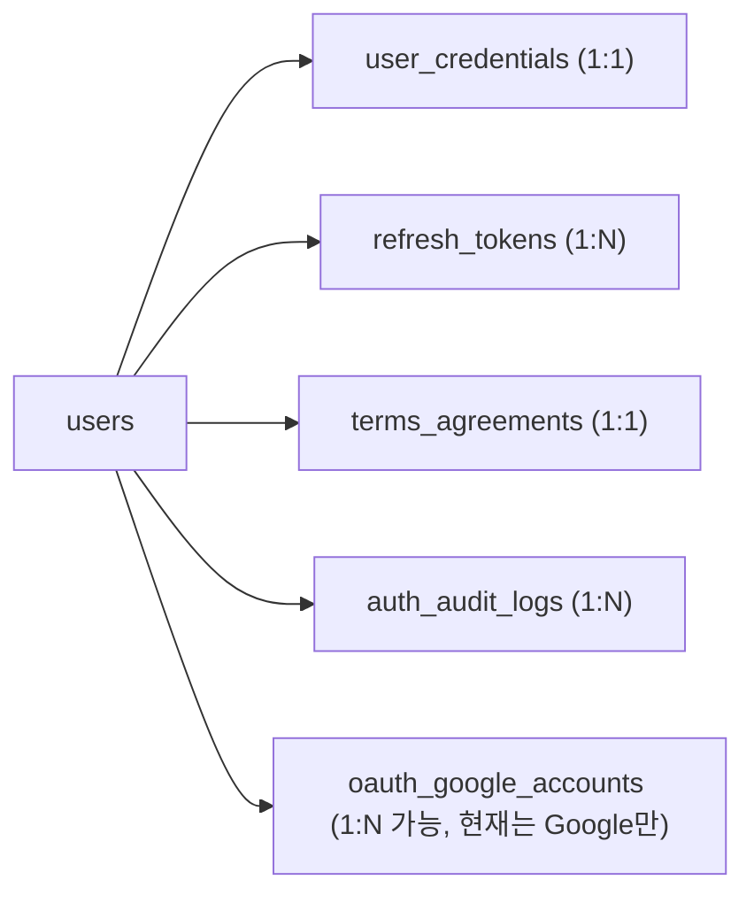
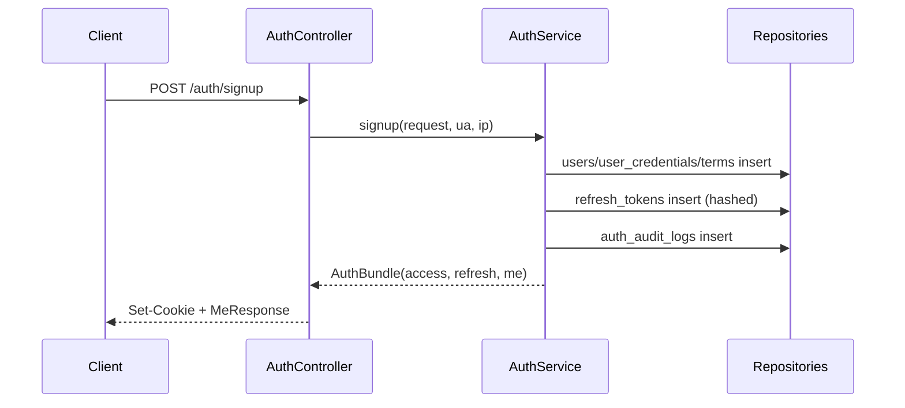

# Backend Architecture Walkthrough (Spring) - facadely

이 문서는 facadely 백엔드 구조를 빠르게 이해하기 위한 아키텍처 워크스루입니다.
설명 기준은 현재 코드이며, "무엇을 썼는지"보다 "왜 이렇게 나눴는지"와 요청이 어떻게 흐르는지를 중심으로 정리합니다.

- 프로젝트 루트: `repo root`
- 백엔드 루트: `/backend`
- 문서 기준일: 2026-03-03

---

## 1. 이 백엔드가 하는 일 (한 문장)

이 백엔드는 **회원가입/로그인/로그아웃/세션 유지(리프레시)/내 정보 조회/구글 로그인**을 담당하며,
인증 상태는 **HttpOnly 쿠키 + JWT Access Token + DB 저장형 Refresh Token**으로 유지합니다.

---

## 2. 처음 보는 사람이 가장 먼저 잡아야 할 개념

백엔드를 처음 보면 파일이 많아 보이지만, 실제로는 아래 7개 역할로 나뉩니다.

1. `Controller`: HTTP 요청/응답 입구
2. `Service`: 실제 비즈니스 로직
3. `Repository`: DB 읽기/쓰기
4. `Domain(Entity)`: DB 테이블과 매핑되는 객체
5. `DTO`: API 입력/출력 전용 데이터 형태
6. `Security/Config`: 인증, 쿠키, CORS, 보안 정책
7. `Exception Handler`: 에러를 일정한 JSON 형태로 반환

핵심 규칙:
- `Controller`는 얇게 유지 (검증/입출력 중심)
- 복잡한 판단은 `Service`에서 처리
- DB 쿼리는 `Repository`로 분리

이 구조를 지키면, 나중에 기능이 커져도 수정 위치가 명확합니다.

---

## 3. 실제 폴더 구조와 역할

```text
backend/src/main/java/com/facadely/backend
├── BackendApplication.java                     # 스프링 부트 시작점
├── health
│   └── HealthController.java                  # /api/v1/health
├── common
│   ├── dto/ErrorResponse.java                 # 공통 에러 응답
│   └── exception
│       ├── ApiException.java                  # 비즈니스 예외
│       └── GlobalExceptionHandler.java        # 전역 예외 처리
└── auth
    ├── config
    │   ├── AuthProperties.java                # application.yml 바인딩
    │   ├── CookieFactory.java                 # Set-Cookie 생성
    │   └── SecurityConfig.java                # Spring Security 정책
    ├── controller
    │   └── AuthController.java                # auth API 엔드포인트
    ├── dto                                    # 요청/응답 DTO
    ├── domain                                 # JPA Entity + Enum
    ├── repository                             # Spring Data JPA 인터페이스
    ├── security
    │   ├── JwtTokenProvider.java              # JWT 생성/검증
    │   ├── JwtAuthenticationFilter.java       # 쿠키 JWT 인증 필터
    │   ├── JsonAuthenticationEntryPoint.java  # 401 JSON 응답
    │   ├── OAuth2LoginSuccessHandler.java     # 구글 성공 후 후처리
    │   └── OAuth2LoginFailureHandler.java     # 구글 실패 후 리다이렉트
    └── service
        ├── AuthService.java                   # 인증 핵심 로직
        └── LoginAttemptService.java           # 로그인 시도 제한(메모리 기반)
```

리소스/설정:

```text
backend/src/main/resources
├── application.yml                            # 앱/DB/보안/OAuth 설정
└── db/migration/V1__auth_init.sql            # Flyway 스키마
```

---

## 4. 실행 시 내부에서 무슨 일이 일어나는가

앱 기동 순서(간단 버전):

1. `BackendApplication` 실행
2. `application.yml` 로드
3. `AuthProperties`에 `app.auth.*` 설정 바인딩
4. DataSource 생성 (PostgreSQL 연결)
5. Flyway가 `V1__auth_init.sql` 실행/검증
6. SecurityFilterChain 생성
7. HTTP 요청 대기

이 순서를 아는 이유:
- 문제가 터졌을 때 어디서 실패했는지 좁히기 쉬움
- 예: DB 연결 실패는 애플리케이션 로직 전에 발생

---

## 5. Controller / Service / DTO / Repository를 왜 분리했는가

### 5.1 Controller (입구)

파일: `backend/src/main/java/com/facadely/backend/auth/controller/AuthController.java`

하는 일:
- URL 매핑 (`/api/v1/auth/*`)
- DTO 검증 (`@Valid`)
- 쿠키 추출/응답 쿠키 세팅
- 인증 사용자 ID 꺼내기 (`Authentication`)

하지 않는 일:
- 비밀번호 검증 세부 로직
- 토큰 DB 저장 로직
- 계정 생성 규칙

왜 이렇게?
- HTTP 표현(헤더/쿠키/상태코드)과 비즈니스 규칙을 섞지 않기 위해

### 5.2 Service (핵심 규칙)

파일: `backend/src/main/java/com/facadely/backend/auth/service/AuthService.java`

하는 일:
- 회원가입/로그인/리프레시/로그아웃/내정보 조회
- 구글 로그인 계정 연결
- 토큰 발급/회전
- 감사 로그 기록

왜 이렇게?
- 정책이 바뀌면 Controller보다 Service를 더 자주 수정함
- 이 레이어를 중심으로 테스트하기 쉬움

### 5.3 DTO (계약)

파일들:
- `backend/src/main/java/com/facadely/backend/auth/dto/SignupRequest.java`
- `backend/src/main/java/com/facadely/backend/auth/dto/LoginRequest.java`
- `backend/src/main/java/com/facadely/backend/auth/dto/MeResponse.java`
- `backend/src/main/java/com/facadely/backend/auth/dto/TermsAgreeRequest.java`
- `backend/src/main/java/com/facadely/backend/auth/dto/MessageResponse.java`

왜 DTO를 따로?
- Entity를 API에 그대로 노출하면 DB 구조 변경이 API 파괴로 이어짐
- DTO 검증 어노테이션으로 잘못된 입력을 초기에 차단 가능

### 5.4 Repository (DB 접근)

파일들:
- `backend/src/main/java/com/facadely/backend/auth/repository/UserAccountRepository.java`
- `backend/src/main/java/com/facadely/backend/auth/repository/UserCredentialRepository.java`
- `backend/src/main/java/com/facadely/backend/auth/repository/RefreshTokenRepository.java`
- `backend/src/main/java/com/facadely/backend/auth/repository/TermsAgreementRepository.java`
- `backend/src/main/java/com/facadely/backend/auth/repository/OAuthGoogleAccountRepository.java`
- `backend/src/main/java/com/facadely/backend/auth/repository/AuthAuditLogRepository.java`

왜 인터페이스만 있는데 동작하나?
- Spring Data JPA가 메서드 이름(`findBy...`)을 읽어 구현체를 런타임에 생성

---

## 6. 데이터 모델을 기초부터 이해하기

스키마 파일:
- `backend/src/main/resources/db/migration/V1__auth_init.sql`

핵심 테이블:

1. `users`
- 사용자 기본 프로필 (email, name, role, status)

2. `user_credentials`
- 비밀번호 해시 저장 전용
- `user_id`가 PK이며 `users.id`와 1:1

3. `refresh_tokens`
- 리프레시 토큰의 **해시값** 저장
- 토큰 원문은 DB에 저장하지 않음

4. `terms_agreements`
- 약관/개인정보 동의 버전 기록

5. `auth_audit_logs`
- 인증 이벤트 감사 로그 (signup/login/refresh/logout/google)

6. `oauth_google_accounts`
- Google `sub`와 내부 `user_id`연결

관계 요약:



왜 이 분리?
- 자주 읽는 사용자 기본정보(`users`)와 민감정보(`user_credentials`)를 분리
- 토큰 회전/폐기를 DB 레벨로 통제하기 위해 `refresh_tokens` 독립

---

## 7. 보안 구성(Security)을 기초부터 이해하기

### 7.1 SecurityConfig

파일:
- `backend/src/main/java/com/facadely/backend/auth/config/SecurityConfig.java`

핵심 설정:

1. 공개 엔드포인트 허용
- `/api/v1/health`
- `POST /api/v1/auth/signup`, `login`, `refresh`
- `/api/v1/auth/oauth2/**`

2. 나머지 요청은 인증 필요

3. JWT 필터 등록
- `JwtAuthenticationFilter`를 `UsernamePasswordAuthenticationFilter`앞에 배치

4. OAuth2 로그인 성공/실패 핸들러 연결

5. CORS 허용 Origin을 `app.auth.frontend-origin`으로 제한

6. PasswordEncoder는 Argon2 사용

### 7.2 왜 Access/Refresh를 둘 다 쓰는가

- Access Token(짧은 수명, 기본 15분): 자주 검증되는 인증 증표
- Refresh Token(긴 수명, 기본 14일): Access 만료 시 재발급

장점:
- 탈취 위험이 있는 Access의 노출 시간을 줄임
- Refresh를 DB에서 폐기(revoke) 가능

### 7.3 왜 Refresh 원문 대신 해시를 저장하는가

- DB 유출 시 원문 토큰이 바로 재사용되는 위험을 낮춤
- 현재 코드는 SHA-256 해시를 저장

### 7.4 왜 HttpOnly 쿠키인가

- JS에서 토큰을 직접 읽기 어렵게 하여 XSS 공격면 축소
- 프론트 fetch에서 `credentials: 'include'`로 자동 전송

---

## 8. 요청이 들어오면 코드가 어떻게 상호작용하는가

아래는 가장 중요한 6개 흐름입니다.

## 8.1 회원가입 (`POST /api/v1/auth/signup`)

1. `AuthController.signup`이 `SignupRequest`검증
2. `AuthService.signup`호출
3. 중복 이메일 검사 (`UserAccountRepository.existsByEmailIgnoreCase`)
4. `users`저장
5. 비밀번호 Argon2 해시 후 `user_credentials`저장
6. 약관동의 저장 (`terms_agreements`)
7. 감사 로그 저장
8. Access/Refresh 발급 + Refresh 해시 DB 저장
9. Controller가 Set-Cookie 2개(access, refresh) 내려줌
10. `MeResponse`반환



## 8.2 로그인 (`POST /api/v1/auth/login`)

1. `LoginAttemptService.isLocked`로 과도한 시도 차단
2. 사용자/자격증명 조회
3. `passwordEncoder.matches`로 해시 검증
4. 성공 시 실패기록 초기화
5. 감사 로그 저장
6. 토큰 발급 + 쿠키 반환

실패 시:
- `ApiException(401, INVALID_CREDENTIALS)`
- `GlobalExceptionHandler`가 표준 JSON으로 변환

## 8.3 내 정보 조회 (`GET /api/v1/auth/me`)

1. 요청이 Security FilterChain 통과
2. `JwtAuthenticationFilter`가 access cookie 추출
3. JWT 검증 성공 시 `SecurityContext`에 사용자 주체(subject=userId) 저장
4. `AuthController.me`에서 `Authentication`으로 userId 획득
5. `AuthService.me`가 `users`, `terms_agreements`조회 후 응답

## 8.4 토큰 재발급 (`POST /api/v1/auth/refresh`)

1. Controller가 refresh cookie 추출
2. Service가 해시 후 DB에서 유효 토큰 조회
3. 기존 토큰 즉시 revoke (`revoked_at`설정)
4. 새 access/refresh 발급
5. 새 refresh 해시 저장
6. 새 쿠키 발급

이것을 **Refresh Token Rotation**이라고 부릅니다.

## 8.5 로그아웃 (`POST /api/v1/auth/logout`)

1. refresh cookie 기반 토큰 조회
2. 있으면 revoke 처리
3. access/refresh 쿠키 Max-Age=0으로 삭제

## 8.6 구글 로그인 (`/api/v1/auth/oauth2/authorization/google`)

1. 브라우저가 구글 인증으로 이동
2. 콜백: `/api/v1/auth/oauth2/callback/google`
3. 성공 시 `OAuth2LoginSuccessHandler`동작
4. `sub/email/name`추출
5. `AuthService.handleGoogleLogin`에서
- 기존 google_sub 연결 조회
- 없으면 email 기준 사용자 생성/조회 + oauth_google_accounts 연결 저장
6. 토큰 발급/쿠키 세팅
7. 프론트 로그인 페이지로 리다이렉트 (`?oauth=success`)

실패 시:
- `OAuth2LoginFailureHandler`가 `?oauth=error&error=google_login_failed`로 리다이렉트

---

## 9. DTO 검증과 예외 응답이 왜 중요한가

DTO 검증:
- 예: `SignupRequest.password`는 `@Size(min=8, max=72)`
- 예: `@AssertTrue agreeTerms`로 약관 동의 필수

검증 실패 시 흐름:
1. Spring이 `MethodArgumentNotValidException`발생
2. `GlobalExceptionHandler`가 잡음
3. 클라이언트에 아래 형태로 반환

```json
{
  "timestamp": "2026-03-03T12:00:00Z",
  "status": 400,
  "code": "VALIDATION_ERROR",
  "message": "입력값 검증에 실패했습니다.",
  "details": {
    "email": "must be a well-formed email address"
  }
}
```

왜 좋은가?
- 프론트가 field 단위로 정확히 에러 매핑 가능
- 서버 로그를 보지 않아도 API 사용자 입장에서 실패 원인 파악 가능

---

## 10. 설정 파일을 읽는 법 (application.yml)

파일:
- `backend/src/main/resources/application.yml`

중요 포인트:

1. `spring.jpa.hibernate.ddl-auto: validate`
- 엔티티와 DB 스키마 불일치 시 기동 실패
- 실무에서 안전한 편 (스키마 자동 변경 방지)

2. `spring.flyway.enabled: true`
- DB 변경 이력을 SQL 마이그레이션으로 관리

3. OAuth2 redirect-uri
- `{baseUrl}/api/v1/auth/oauth2/callback/{registrationId}`

4. `app.auth.*`
- 프론트 Origin, JWT 만료, 쿠키 정책, 약관 버전 등을 한곳에서 관리

환경변수 샘플:
- `backend/.env.example`

---

## 11. 왜 `AuthProperties`+ `CookieFactory`를 따로 뒀는가

### AuthProperties

역할:
- `application.yml`값을 타입 안전하게 주입

장점:
- 문자열 하드코딩 감소
- 설정 키 변경 영향 범위를 줄임

### CookieFactory

역할:
- access/refresh 쿠키 생성 정책을 한곳에 모음

장점:
- 모든 컨트롤러/핸들러가 동일 정책 사용
- `Secure`, `SameSite`, `Path`정책 누락 방지

---

## 12. Refresh Token은 왜 별도 secret이 없는가?

현재 구현은:
- Access Token만 JWT
- Refresh는 랜덤 문자열 + DB 해시 저장 방식

즉, refresh는 서명 검증보다 **DB에 저장된 해시와 만료/폐기 상태**로 유효성을 판단합니다.

왜 이렇게 했나?
- 리프레시 토큰 원문을 DB에 저장하지 않아도 됨
- 서버가 토큰을 즉시 폐기(revoke)할 수 있음
- Access JWT와 역할이 명확히 분리됨

초보자 관점 체크:
- 모든 토큰이 꼭 JWT일 필요는 없습니다.
- "랜덤 토큰 + DB 해시 저장"도 운영에서 자주 쓰는 정석적인 방식입니다.

---

## 13. 로그인 시도 제한(LoginAttemptService) 이해

파일:
- `backend/src/main/java/com/facadely/backend/auth/service/LoginAttemptService.java`

현재 정책:
- 15분 윈도우 내 실패 5회 이상이면 잠금
- 키: `email + ip`
- 저장소: 메모리(`ConcurrentHashMap`)

장점:
- 구현이 단순하고 즉시 동작

주의점:
- 서버 재시작 시 초기화
- 멀티 인스턴스 환경에서 공유되지 않음

향후 개선:
- Redis 기반 rate limit으로 이동

---

## 14. 프론트와 연결되는 지점

프론트 API 클라이언트:
- `src/lib/api/auth.ts`

핵심:
- `credentials: 'include'`로 쿠키 전송
- 백엔드 베이스 URL: `NEXT_PUBLIC_API_BASE_URL`

라우트 보호 프록시:
- `src/proxy.ts`

동작:
- 보호 라우트 접근 시 백엔드 `/auth/me`호출
- 401이면 로그인으로 리다이렉트

이 구조의 의미:
- 인증 소스 오브 트루스를 Spring으로 통일

---

## 15. 디버깅을 처음부터 끝까지 하는 순서

문제 발생 시 아래 순서로 좁히면 됩니다.

1. 서버 기동 확인
- `GET /api/v1/health`

2. DB/Flyway 확인
- 앱 시작 로그에 Flyway 성공 여부

3. 쿠키 발급 확인
- 로그인 응답 헤더에 `Set-Cookie`2개 있는지

4. 쿠키 전송 확인
- 후속 요청에 access cookie가 포함되는지

5. 인증 컨텍스트 확인
- `/auth/me`가 200인지 401인지

6. 예외 형식 확인
- `GlobalExceptionHandler`JSON 구조로 나오는지

7. CORS 확인
- `FRONTEND_ORIGIN`값이 현재 프론트 주소와 일치하는지

---

## 16. “새 API 하나 추가” 실전 가이드 (초보자 루틴)

예시: `GET /api/v1/auth/audit-summary`를 만든다고 가정

1. DTO 먼저 정의
- 응답 필드부터 고정

2. Service 메서드 작성
- 비즈니스 규칙/조회 조합 구현

3. Repository 메서드 추가
- 필요한 조회 쿼리 정의

4. Controller에서 엔드포인트 연결
- 입력 검증, 응답 매핑

5. Security 접근권한 검토
- 인증 필요 여부/role 정책 반영

6. 실패 케이스 정의
- `ApiException`코드/메시지 설계

7. 문서 업데이트
- 본 문서 + phase 문서 동기화

왜 이 순서?
- API 계약(DTO)과 로직(Service)을 먼저 고정하면, 컨트롤러 구현이 단순해지고 재작업이 줄어듭니다.

---

## 17. 현재 코드에서 좋은 점과 다음 개선 포인트

좋은 점:
- 인증 핵심 사이클(가입/로그인/리프레시/로그아웃) 완성
- 구글 OAuth 단일 공급자로 복잡도 제어
- 전역 예외/표준 에러 응답 정리
- DB 스키마가 Flyway로 관리됨

개선 포인트:
- 인증 통합테스트는 추가됐지만, OAuth 성공/실패 흐름 테스트는 더 보강 가능
- LoginAttemptService 메모리 제한 -> Redis 전환 검토
- 감사 로그 조회는 `GET /api/v1/auth/audit-summary`까지 제공, 상세 분석 API는 추후 확장 가능

---

## 18. 로컬 실행 치트시트

1. DB 실행
```bash
cd  backend
docker compose up -d
```

2. 백엔드 테스트
```bash
cd  backend
./gradlew test
```

3. 백엔드 실행
```bash
cd  backend
./gradlew bootRun
```

4. 프론트 실행
```bash
cd .
npm run dev
```

---

## 19. 마지막 요약 (진짜 핵심만)

- `Controller`는 HTTP 입구, `Service`는 규칙, `Repository`는 DB, `DTO`는 계약
- 인증은 쿠키 기반이지만, 내부적으로는 JWT(access) + DB(refresh) 회전 구조
- 구글 로그인도 결국 `AuthService`로 들어와 동일 토큰 발급 흐름을 재사용
- 예외/검증/설정을 분리했기 때문에, 기능 추가 시 수정 지점이 명확함

이 문서를 읽은 다음에는 아래 순서로 코드를 보면 이해가 가장 빠릅니다.

1. `backend/src/main/java/com/facadely/backend/auth/controller/AuthController.java`
2. `backend/src/main/java/com/facadely/backend/auth/service/AuthService.java`
3. `backend/src/main/java/com/facadely/backend/auth/config/SecurityConfig.java`
4. `backend/src/main/resources/db/migration/V1__auth_init.sql`
